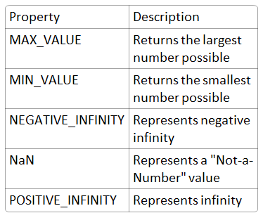

# Number

## JavaScript Numbers are Always 64-bit Floating Point

Unlike many other programming languages, JavaScript does not define different types of numbers, like integers, short, long, floating-point etc. JavaScript numbers are always stored as double precision floating point numbers, following the international IEEE 754 standard.

| Value \(aka Fraction/Mantissa\) | Exponent | Sign |
| :--- | :--- | :--- |
| 52 bits \(0 - 51\) | 11 bits \(52 - 62\) | 1 bit \(63\) |

## Infinity and -Infinity

## use the toString\(\) method to output numbers as base 16 \(hex\), base 8 \(octal\), or base 2 \(binary\)

```text
var myNumber = 128;
    myNumber.toString(16);     // returns 80
    myNumber.toString(8);      // returns 200
    myNumber.toString(2);      // returns 10000000
```

## NaN Not a Number

```javascript
var x = 100 / "Apple";  // x will be NaN 
isNaN(x);     // returns true because x is Not a Number
```

## Methods to format Numbers

```text
var x = 9.656;
x.toExponential(2);     // returns 9.66e+0
x.toExponential(4);     // returns 9.6560e+0

x.toFixed(0);           // returns 10
x.toFixed(2);           // returns 9.66

x.toPrecision(2);       // returns 9.7
x.toPrecision(4);       // returns 9.656
```

## Convert to number \(parseInt, parseFloat or just use Number\)

```javascript
var test = "100.534";
var resultInt = parseInt(test); // 100
var resultFloat = parseFloat(test); // 100.534
var resultFloat = Number(test); // 100.534
// We can detect not a number with isNaN.
```

## Number Properties



NEGATIVE\_INFINITY and POSITIVE\_INFINITY returned on overflow var x = Number.MAX\_VALUE;

